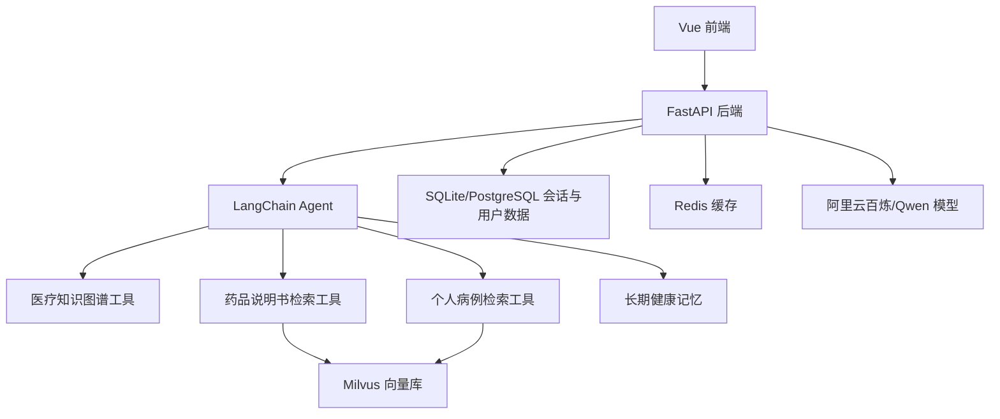

# Medical Agent

一个面向个人健康资料管理和用药安全分析的医疗 Agent 项目。系统支持上传药品说明书、个人病历和检查单，通过 LangChain Agent 调用医疗知识图谱、药品说明书检索、个人病例检索和长期健康记忆，帮助用户整理用药注意事项、病例重点和就诊前问题清单。

> 本项目定位为医疗科普与就诊准备助手，不替代医生诊断，不直接给出处方或治疗方案。

## 项目亮点

- **具体医疗应用场景**：不是通用 RAG 复现，而是围绕“药品说明书 + 个人病例 + 就诊沟通”构建完整应用。
- **LangChain Agent 工具调用**：Agent 可根据问题选择调用医疗知识图谱、药品说明书库、个人病例库等工具。
- **病例档案管理**：用户可以创建多个病例档案，例如“病例甲”“妈妈体检报告”“小朋友发烧”，病历和检查单只在明确点名病例时才被调取。
- **药品说明书与病例解耦**：药品说明书不绑定单个病例；只有用户明确说“结合病例甲”时，Agent 才进行病例与说明书交叉分析。
- **图片 OCR 入库**：支持上传 JPG、PNG、WebP 等图片资料，通过视觉模型提取药品说明书、病历和检查单文字。
- **长期健康记忆**：系统会整理用户主动提供的过敏史、用药史、症状和上传资料，但只在用户明确要求结合个人情况时使用。
- **Milvus 混合检索**：支持稠密向量 + BM25 稀疏向量的 Hybrid Search，并保留 Auto-merging 父子分块能力。
- **可演示的完整前后端**：包含登录注册、聊天、上传、病例档案、文档列表、流式回答和 RAG 检索过程展示。

## 核心场景

### 1. 药品说明书分析

用户上传药品说明书图片或文档后，可以询问：

```text
请基于我上传的药品说明书《xxx.png》，帮我整理适应症、用法用量、禁忌、不良反应和注意事项。
```

此时 Agent 只检索药品说明书库，不主动代入个人病例。

### 2. 个人病历/检查单整理

用户上传病历、检查单或报告图片时，可以绑定到指定病例档案：

```text
病例档案：甲
资料类型：个人病历/检查单
```

之后可以询问：

```text
结合病例甲，帮我整理这份检查单里的异常指标和就诊前要问医生的问题。
```

此时 Agent 只调取“病例甲”相关资料，不会混入其他病例。

### 3. 病例与药品说明书交叉分析

当用户明确点名病例和药品时，Agent 会同时检索病例库与药品说明书库：

```text
结合病例甲和药品说明书《xxx.png》，帮我判断用药注意事项。
```

回答会分为：

```text
1. 病例甲中的相关信息
2. 药品说明书中的关键信息
3. 两者交叉后的用药风险点
4. 建议向医生或药师确认的问题
```

### 4. 会话内病例上下文继承

如果本轮会话前面已经明确讨论过“病例甲”，后续用户问：

```text
那我应该怎么跟医生沟通？
```

Agent 会继承当前会话中最近明确提到的病例甲，继续围绕该病例回答。  
如果历史中没有明确病例，Agent 会反问用户要结合哪个病例档案，而不是自行调取所有病例。

## 技术架构



## 技术栈

- **后端**：FastAPI, SQLAlchemy, Pydantic
- **Agent**：LangChain Agent, LangChain Tools
- **模型**：阿里云百炼 OpenAI-compatible API, Qwen 文本模型, Qwen-VL OCR
- **向量库**：Milvus Hybrid Search
- **检索**：Dense Embedding, BM25 Sparse Embedding, RRF, Auto-merging
- **数据库/缓存**：SQLite 本地开发，PostgreSQL/Redis 可选
- **前端**：Vue 3 CDN, HTML, CSS, JavaScript
- **部署依赖**：Docker Compose

## Agent 工具设计

| 工具 | 作用 |
| --- | --- |
| `search_medical_kg` | 查询疾病、症状、检查、科室、饮食、治疗方式等医疗知识图谱信息 |
| `search_drug_instruction` | 查询用户上传的药品说明书 |
| `search_user_case` | 查询用户明确点名的病例档案资料 |
| `search_knowledge_base` | 通用文档检索兜底工具 |

病例检索遵循严格范围控制：

```text
没有点名病例 -> 不查病例
点名病例甲 -> 只查病例甲
本会话刚聊过病例甲，后续问医生沟通/下一步怎么办 -> 继承病例甲
```

## 项目结构

```text
medical-agent/
├── backend/
│   ├── app.py                 # FastAPI 入口，静态前端挂载
│   ├── api.py                 # 登录、聊天、上传、病例档案接口
│   ├── agent.py               # LangChain Agent、健康记忆、病例上下文控制
│   ├── tools.py               # Agent 工具：知识图谱、说明书、病例检索
│   ├── medical_kg.py          # 医疗知识图谱数据接入
│   ├── document_loader.py     # PDF/Word/Excel/图片 OCR 文档解析
│   ├── milvus_client.py       # Milvus Collection 与检索
│   ├── milvus_writer.py       # 向量化入库
│   ├── rag_utils.py           # RAG 检索、rerank、auto-merging
│   ├── models.py              # User、Message、HealthProfile、MedicalCase 等 ORM 模型
│   └── schemas.py             # Pydantic 请求/响应模型
├── frontend/
│   ├── index.html             # 单页前端
│   ├── script.js              # Vue 逻辑、聊天、上传、病例档案
│   └── style.css              # 页面样式
├── data/
│   └── documents/             # 上传文件保存目录
├── docker-compose.yml         # Milvus/Postgres/Redis 等依赖
└── README.md
```

## 本地运行

### 1. 启动依赖

```bash
docker compose up -d
```

### 2. 配置环境变量

复制 `.env.example` 并创建 `.env`：

```bash
cp .env.example .env
```

常用配置示例：

```env
ARK_API_KEY=your_api_key
BASE_URL=https://dashscope.aliyuncs.com/compatible-mode/v1
MODEL=qwen-plus
GRADE_MODEL=qwen-turbo
FAST_MODEL=qwen-turbo
OCR_MODEL=qwen-vl-plus

DATABASE_URL=sqlite:///./data/dev.db
JWT_SECRET_KEY=replace-with-a-random-secret
ADMIN_INVITE_CODE=medical-agent-admin-2026

MILVUS_HOST=127.0.0.1
MILVUS_PORT=19530
MILVUS_COLLECTION=embeddings_collection
```

### 3. 启动后端

```bash
cd backend
uv run uvicorn app:app --host 127.0.0.1 --port 8000
```

访问：

```text
http://127.0.0.1:8000/
```

## 安全边界

系统会尽量基于上传资料和检索结果给出结构化整理，但仍需遵守以下边界：

- 不做最终诊断
- 不替代医生或药师
- 不直接给出处方
- 涉及儿童、孕产妇、过敏史、肝肾功能异常、多药联用等情况时，必须建议咨询医生或药师
- 对 OCR 结果和用户上传资料保持不确定性提示

## 后续优化方向

- 病历结构化抽取：自动提取症状、诊断、药物、检查指标、异常值和时间线。
- 病例时间线：支持同一病例下多次检查对比。
- 来源引用：回答中展示来自哪份说明书、哪份病历、哪条知识图谱。
- 权限与隐私：加强敏感医疗资料加密、访问控制和删除审计。
- RAG 评估：构建小型医疗问答评估集，对比 dense、sparse、hybrid、rerank 效果。
- 多 Agent 拆分：将药品说明书分析、病例摘要、就诊沟通分别拆成专业子 Agent。
